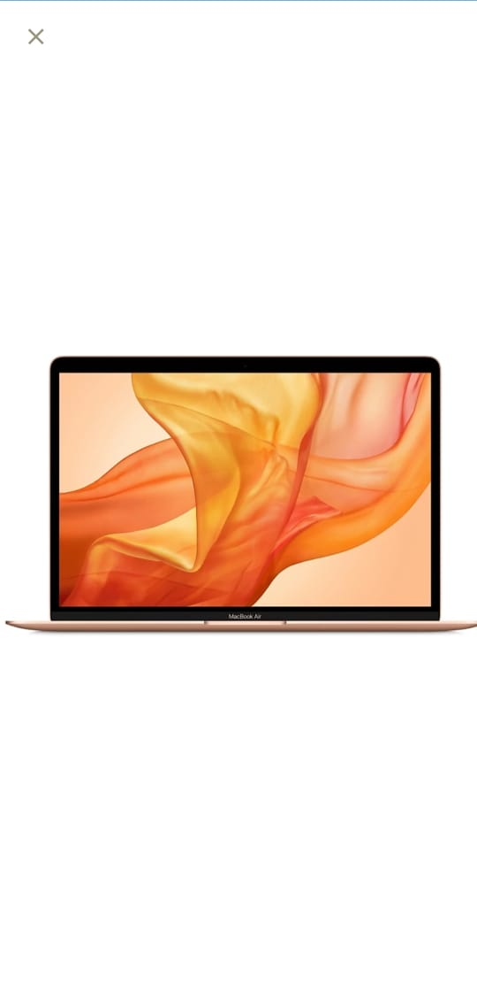

# User Shopping Point

Now days, a mobile application has bought a lot of changes in shopping. Specially, the new technology called augmented reality system made in feasible an advanced way of information collecting by giving data of the virtual world to real world. 
Smart shopping using augmented reality developed in android for shopaholics who have crazy about shopping. The shoppers use this application (app) while shopping to reduce their bucks and time. 
Shopping is an interesting process in which a customer selects the available materials or services provided by one or more retail merchant with the intention to buy a suitable selection of them

  

         
         
         
         
         
         
         
         
         
         
         
         
         
         
